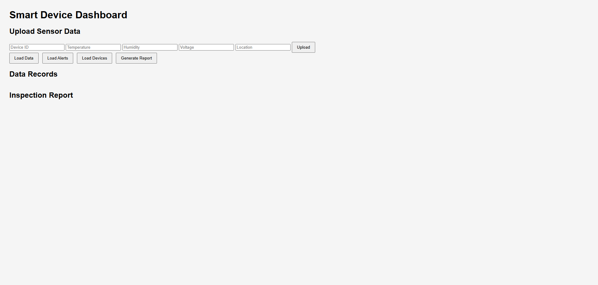

# Smart Device Monitoring and Alert Dashboard

A full-stack IoT device monitoring MVP built with **FastAPI**, **SQLite**, and **HTML/CSS/JavaScript**.

This project simulates a basic smart device monitoring workflow: sensor data can be uploaded through a web dashboard or a Python device simulator, processed by a FastAPI backend, stored in SQLite, and displayed on a frontend dashboard.

## Screenshot



## Features

- Upload sensor data from the dashboard
- Simulate IoT device data upload with a Python script

- Upload sensor data from the dashboard
- Simulate IoT device data upload with a Python script
- Validate incoming data with Pydantic
- Detect device status: `normal`, `alert`, and `danger`
- Store sensor records in SQLite
- View all sensor records
- View alert records
- View device statistics
- Delete individual records
- Generate rule-based inspection reports

## Tech Stack

- **Backend:** Python, FastAPI, Pydantic, Uvicorn
- **Database:** SQLite, SQL
- **Frontend:** HTML, CSS, JavaScript, Fetch API
- **Tools:** Git, GitHub, Requests, CORS Middleware

## Project Structure

```text
smart-device-monitoring-dashboard/
├── main.py
├── database.py
├── models.py
├── services.py
├── device_simulator.py
├── frontend/
│   └── dashboard.html
├── README.md
└── .gitignore
```

## API Endpoints

| Method | Endpoint | Description |
|---|---|---|
| GET | `/` | Backend health check |
| GET | `/status` | Get system status |
| POST | `/upload` | Upload sensor data |
| GET | `/data` | Get sensor records |
| GET | `/alerts` | Get alert records |
| GET | `/devices` | Get device statistics |
| GET | `/report` | Generate inspection report |
| DELETE | `/data/{record_id}` | Delete a sensor record |

## How to Run

Install dependencies:

```bash
py -m pip install fastapi uvicorn requests
```

Start the backend:

```bash
py -m uvicorn main:app --reload
```

Open API documentation:

```text
http://127.0.0.1:8000/docs
```

Open the dashboard:

```text
frontend/dashboard.html
```

Run the device simulator in a separate terminal:

```bash
py device_simulator.py
```

Stop the simulator with:

```text
Ctrl + C
```

## Future Improvements

- Add charts for temperature and alert trends
- Replace SQLite with PostgreSQL
- Add MQTT support for more realistic IoT communication
- Add device online/offline detection
- Integrate AI APIs for advanced inspection reports
- Deploy the backend with Docker
- Build a more polished frontend dashboard with React or Vue